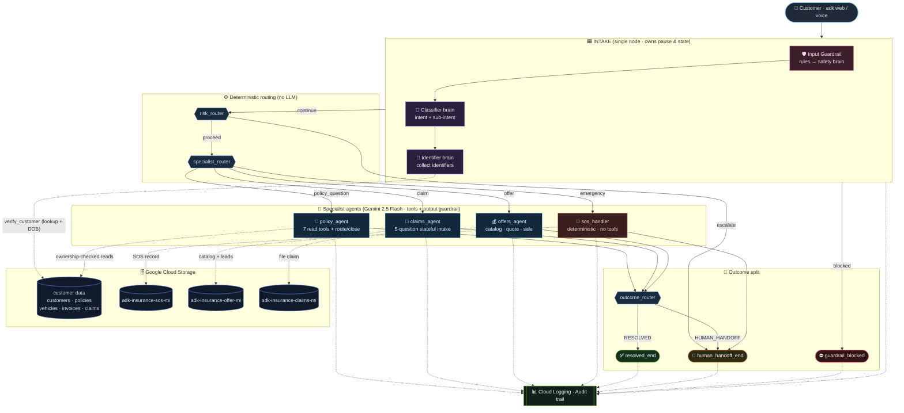
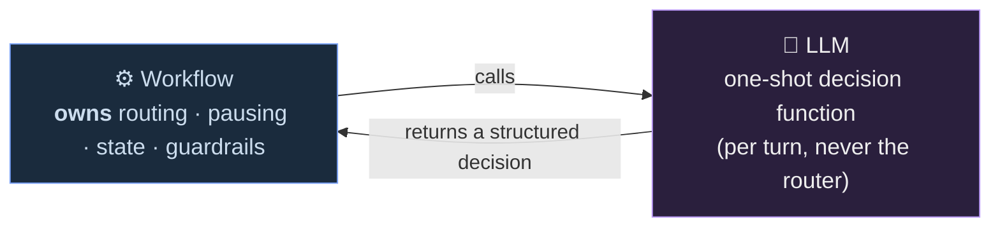

# 🏛️ Full Architecture

> Renders on GitHub automatically. To export an image for slides:
> paste into <https://mermaid.live> → **Export PNG/SVG**, or run
> `mmdc -i docs/ARCHITECTURE_DIAGRAM.md -o docs/architecture.png` (`npm i -g @mermaid-js/mermaid-cli`).

## System overview

## The one idea behind it all

**The Workflow is the boss; the LLM is a calculator it calls.**

## Defense-in-depth (guardrail layers)

| # | Layer | Mechanism |
|---|---|---|
| 1 | Input guardrail | rules (regex) → LLM safety brain only for gray area — **blocks** before any routing |
| 2 | Identity | `verify_customer` GCS lookup + DOB cross-check → verification level |
| 3 | Authorization | verification-level → allowed-actions matrix (deterministic) |
| 4 | Per-tool ownership | every tool checks the record's own `customer_id` |
| 5 | Output guardrail | `after_model_callback` scrubs secrets / card numbers |
| 6 | Audit | every node + tool → Cloud Logging |
