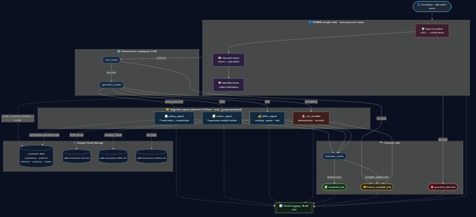

<!-- _class: lead -->

# 🛡️ Guardrailed Multi-Agent Insurance Bot

### Deterministic agent orchestration on Google ADK + Vertex AI Gemini

**A production-shaped assistant that verifies identity, routes deterministically, and never lets an LLM go off the rails.**

Built on Google ADK 2.2.0 · Gemini 2.5 Flash · GCS

---

## The Problem

Insurance support is **high-stakes and regulated**:

- 🔐 You must **verify the caller** before touching any data
- 🎯 Different needs (policy / claim / sales / emergency) → **different rules & risk**
- 🚫 An LLM that "helpfully" leaks another customer's data, follows a prompt-injection, or invents a price is a **compliance incident**, not a bug

**A single chatty LLM can't be trusted to gate itself.**
We need agents *and* hard guardrails — provably, not by vibes.

---

## The Solution

A **Workflow conductor** with **specialist sub-agents**, where:

- The **graph** (deterministic) owns routing, pausing, identity & guardrails
- The **LLM** is used as a **one-shot decision function**, never as the router
- Every customer is **verified before** any specialist tool runs
- Input **and** output **guardrails enforce** (block / redact), not just log

> **One sentence:** *The workflow is the boss; the LLM is a calculator it calls.*

---

## Architecture



<!--
PLACEHOLDER: open docs/architecture.drawio in https://app.diagrams.net (draw.io),
then File ▸ Export as ▸ PNG and save it as docs/architecture.png next to this deck.
(The ASCII overview on the next slide is the fallback if the image is missing.)
-->

- **Deterministic routing** on `intent` + `verification` — never probabilistic LLM delegation
- Verify-before-tools · ownership-checked tools · input **and** output guardrails · two distinct ends

---

## Architecture — flow (fallback view)

```
                    ┌─ INPUT GUARDRAIL (block injection/abuse/off-topic)
  START → intake ───┼─ classify intent  (one-shot brain)
          │         └─ verify identity  (one-shot brain → GCS lookup)
          ▼
     risk_router ──[escalate]→ escalation_handler ─┐
          │                                        │
       [proceed]                                   ▼
          ▼                                  human_handoff_end 🤝
   specialist_router ─→ policy / claims / offers  ──→ outcome_router ─→ resolved_end ✅
                     └─→ sos_handler (emergency) ─────────────────────→ human_handoff_end 🤝
```

- Each specialist has **scoped tools + ownership checks + its own output guardrail**

---

## Guardrails (defense in depth)

| Layer | Where | What it does |
|---|---|---|
| **Input** | `intake` node | Hybrid: regex rules block injection/abuse instantly; LLM safety brain only for the gray area |
| **Identity** | `verify_customer` | GCS lookup + birthdate cross-check → verification level → **allowed-actions matrix** |
| **Per-tool** | every specialist tool | Ownership enforced on the record's own `customer_id` — you only ever see *your* data |
| **Output** | `after_model_callback` | Scrubs secrets / Luhn-valid card numbers before the reply is sent |
| **Risk gate** | `decide_route` | Deterministic escalate-vs-proceed; emergencies always reach a human |

**Guardrails are nodes/callbacks in the graph — a plugin *cannot* block a Workflow root.**

---

## Live Speech (Voice) 🎙️


<!--
PLACEHOLDER: save your voice-session screenshot as docs/voice_live.png next to this deck.
-->

- Same brains & guardrails, driven by **Gemini 3.1 Live** (bidirectional audio)
- Real-time: `CUSTOMER` partial transcripts → `TOOL-CALL classify_intent` → identity `SEARCH/VERIFIED` → barge-in `INTERRUPT`
- The **deterministic guardrail pipeline is reused** — voice is just another channel

---

## Observability — every step is auditable

```
INPUT GUARDRAIL | stage=opening verdict=allow
CLASSIFICATION  | DONE intent=policy_question sub_intent=check invoices risk=MEDIUM
IDENTIFIER      | turn=1 action=lookup phone=True dob=True
SEARCH          | matched cust=cust_005 by phone
IDENTITY SAVED  | identified=True customer_id=cust_005 level=VERIFIED_NEW
ROUTING         | VERIFIED_NEW → proceed
SPECIALIST_ROUTE| cust_005 → policy_question
OUTPUT GUARDRAIL| agent=policy_agent verdict=allow
END             | resolution=HUMAN_HANDOFF   ← success vs escalation, measured
```

Plus structured **audit logs** (Cloud Logging) + **dedicated GCS buckets** for SOS, offers & claims.

---

## Technology Stack

- **Google ADK 2.2.0** — `Workflow` + `@node` graph, `LlmAgent` specialists
- **Vertex AI · Gemini 2.5 Flash** — specialists (tool-calling)
- **Gemini 2.5 Flash-Lite** — intake brains, `thinking_budget=0` for speed
- **Gemini 3.1 Live** — real-time bidirectional voice channel
- **Google Cloud Storage** — customer data + dedicated SOS / offer / claims buckets
- **Cloud Logging** — structured audit trail
- **Python + pytest** — 46 tests (guardrails, ownership, outcomes, resume)

---

## Learnings & Issues We Faced

- ⚠️ **LLM "task-mode" agents crash as paused workflow nodes** (`No function call event found for function response ids`). Fix: **one-shot structured-output brains** + the workflow owns the loop.
- 🔁 **Only the Workflow can pause.** Treat the LLM as a stateless per-turn function; keep all multi-turn state in the graph.
- 🧭 **Deterministic > probabilistic.** LLM-driven agent delegation isn't auditable or guardrailable — we route on explicit state.
- 🧱 **Plugins can't halt a Workflow root** — guardrails had to live *inside* the graph.
- 💬 **Workflow-per-turn ⇒ agents re-greet.** Inject a shared transcript so specialists keep context.
- 🎙️ **Speech in ADK is complex and still lacks some features** — bidi audio, barge-in and transcription needed extra plumbing around the framework.

---

<!-- _class: lead -->

# Demo

<!-- Live demo / play the recording here. Step-by-step script: docs/DEMO_RUNBOOK.md -->

---

<!-- _class: lead -->

# Thank you

**Deterministic orchestration. Enforced guardrails. Full auditability.**

The LLM is powerful — but in a regulated domain, *the graph stays in charge.*
